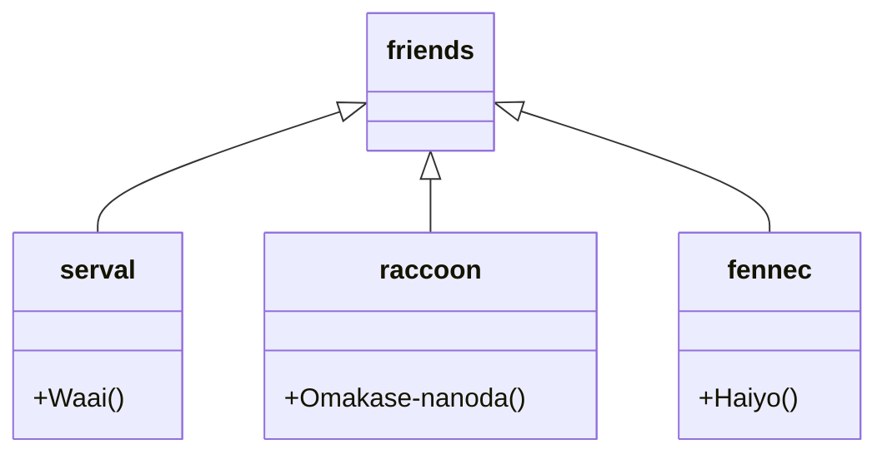
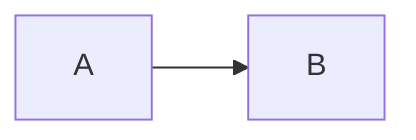

# アプリケーション設計
- team_app (チーム管理)
- rhs_app (稽古管理)
- psc_app (台本管理)

# DB 設計
## テーブル
- rhs_slot (稽古スロット)
    - id
    - team_id
    - start_time
    - end_time

# モジュール設計

```mermaid
classDiagram
    friends<|--serval
    friends<|--raccoon
    friends<|--fennec
    serval : +Waai()
    raccoon : +Omakase-nanoda()
    fennec : +Haiyo()
```

```mermaid
graph LR
    A-->B
```
