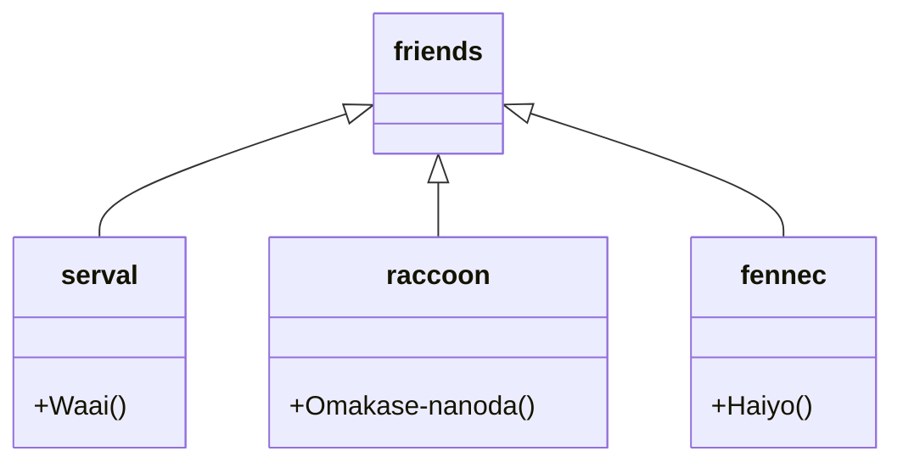
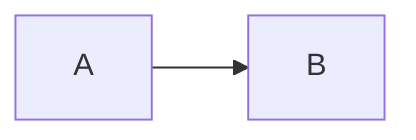

# アプリケーション設計
- accounts (認証, プロファイル)
- teams (チーム管理)
- schedules (スケジュール管理)
- scripts (台本管理)

# DB 設計
## テーブル
- rhs_slot (稽古スロット)
    - id
    - team_id
    - start_time
    - end_time

# モジュール設計

